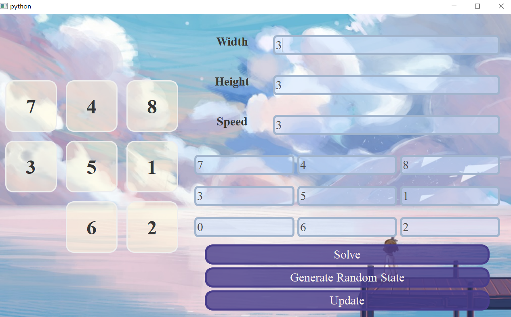

本项目提供了一个九宫格求解AI的交互框架，适用于windows系统。[视频](https://cloud.tsinghua.edu.cn/f/b903cd01dcc74b0d9a35/)

## 使用方式

+ 确保下列依赖已经被安装：
  + python3
  + PyQt5：`pip install PyQt5`
    + 如果下载速度慢可以在最后加上 `-i https://pypi.tuna.tsinghua.edu.cn/simple`
+ 下载代码到本地：`git clone https://github.com/Suikasxt/Sliding-Block.git `
+ 进入目录： `cd Sliding-Block`
+ 运行主程序：`python main.py`

## 交互

+ 主程序默认会与algorithm文件夹下work.exe，原则上你可以使用任何语言编写搜索代码，只需要按照给定的格式输入输出并打包为exe即可
+ 交互格式
  + 主程序向搜索程序stdin输入
    + 第一行两个数n、m表示地图大小n行m列，空格隔开
    + 第二行n*m个数，空格隔开（末尾带一个空格），表示初始地图，顺序为从上到下，从左到右。0表示空格
  + 搜索程序按顺序将解法写入stdout，并刷新缓冲区
    + 每次输出一行有如下两种情况：
      + 一个数，应当是在空格相邻的位置的数字，表示将该格子移动到空格上
      + 字符串“Over”表示输出结束，之后可接两个数字表示解的步数和求解时间，这两个将被直接展示在界面上（不输出则均为0）
    + 注意主程序不会对搜索程序输出的正确性进行检验，请自行确保程序输出正确
+ algorithm中已经写好一份c++的样例程序work.cpp，展示了具体的交互方式，如需要将其编译为exe可以在algorithm目录下使用如下命令：
  + `g++ work.cpp -o work.exe -O2`

## Gui

+ 三个输入框分别为手动设置地图大小与动画速度，矩阵输入为初始状态，程序会对GUI输入的合法性做检验
+ 三个按钮分别为开始程序求解演示、随机生成状态、将手动输入的初始状态应用到地图中
+ 点击数字可以实现挪动

## Todo

+ 美化界面
+ 有其他需求随时可以提出